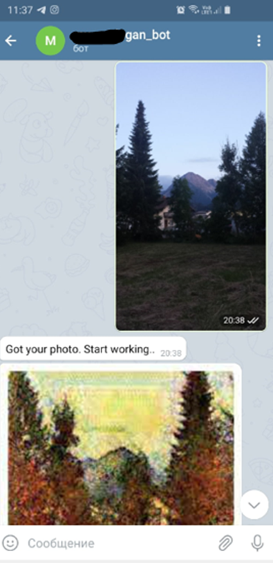
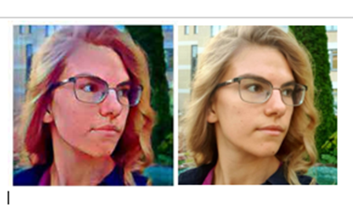

# ganxen
This is a CycleGan net combined with a telegram bot. The files can be downloaded on Kaggle (Van Gogh), then accessed through your own repository. The bot part needs your own token, all the instructions are easily findable on the web. Once you load the data and train your model, you can save the model fie and use it to deploy a bot. It won't fit on Heroku though, because of the large size. The model I trained is also here in a separate file. The results of the training are Van Gogh style images, that are sent back to the user via the bot. Below are some of the results I got.

And a screenshot of the bot.

For fun, I have also tried assembling a disney character dataset to make cartoonified portraits. Sadly, it didn't work. The test results were a bit disappointing, though the train ones were almost decent. I guess it will work with a larger dataset (I had around 250 images of one type and 500 of the other), so you might try it if you're feeling bored enough.

